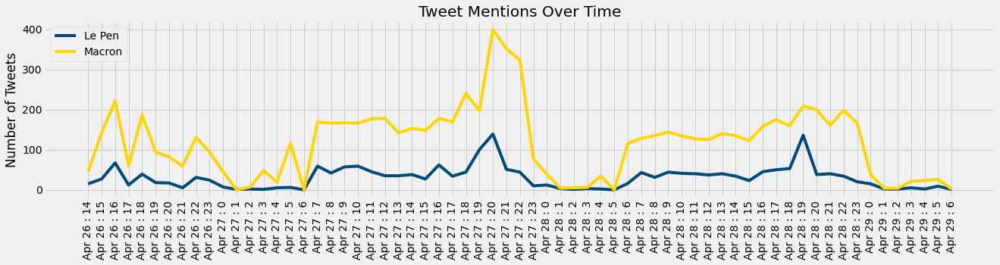
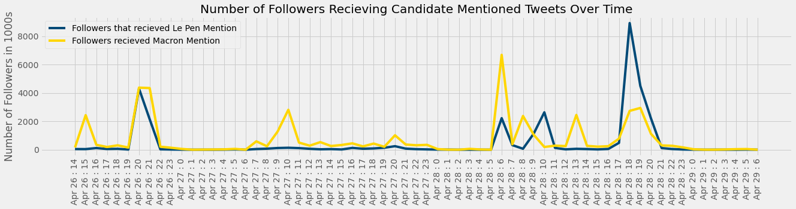
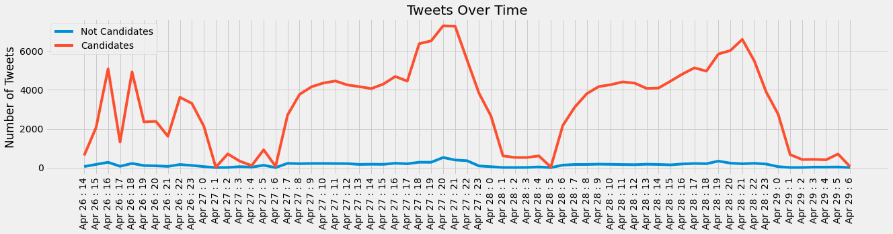

# Mentions of Candidates

## Allan Alberts, Robbie Gamboa, and Isabella Sun

### Introduction
The 2017 French Presidential Election between Emmanuel Macron and Marine Le Pen was a popular topic of discussion on Twitter. Our client, Jacque, requested an analysis of the twitter data surrounding this topic. We presented the key findings below. 

### Data 
Our dataset contains 216,912 tweets published around the time of the elction. The dataset includes information about the tweet, geographic location, time, replies, retweets, favorites, and user information. 

For our analysis, we focused on the text of the tweet, when the tweet was posted, and user information. 

### Analysis 

On average Le Pen had **30.46** twitter mentions per hour where Macron had **118.29** twitter mentions per hour

### Further Study

The limitation of our analysis is that it only accounts for mentions of Le Pen or Macron. We did not consider any possible possitive or negative sentiment about either candidate in the tweets. Additional analysis of the sentiment would be valuable informatin.  
